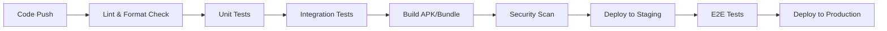

# 🚀 CI/CD Pipeline Documentation

This folder contains comprehensive documentation for Continuous Integration and Continuous Deployment (CI/CD) pipelines, automation workflows, and DevOps best practices.

## 📋 **Quick Navigation**

### 🔧 **Core CI/CD Documentation**
| Document | Purpose | Time to Read | Audience |
|----------|---------|--------------|----------|
| **[Pipeline Documentation](CI_CD_PIPELINE_DOCUMENTATION.md)** | Complete CI/CD setup and configuration | 45 min | DevOps, Senior developers |
| **[Implementation Summary](CI_CD_IMPLEMENTATION_SUMMARY.md)** | Overview of implemented features | 15 min | All team members |
| **[Quick Setup Guide](CI_CD_QUICK_SETUP_GUIDE.md)** | Fast-track setup for new projects | 20 min | DevOps, Project leads |
| **[Performance Optimization](CI_CD_PERFORMANCE_OPTIMIZATION_GUIDE.md)** | Advanced optimization techniques | 30 min | Senior DevOps, Architects |

## 🚀 **Quick Start**

### **New Project Setup (20 minutes)**
```bash
# 1. Read quick setup guide
# Follow: CI_CD_QUICK_SETUP_GUIDE.md

# 2. Configure repository secrets
# GitHub: Settings → Secrets and variables → Actions
# Add: ANDROID_KEYSTORE, STORE_PASSWORD, KEY_PASSWORD

# 3. Set branch protection rules
# GitHub: Settings → Branches → Add rule

# 4. Test with sample PR
git checkout -b test-ci
git push origin test-ci
# Create PR and watch CI run
```

### **Existing Project Integration (30 minutes)**
```bash
# 1. Review current implementation
# Read: CI_CD_IMPLEMENTATION_SUMMARY.md

# 2. Copy workflow files
cp .github/workflows/* your-project/.github/workflows/

# 3. Update configuration
# Follow: CI_CD_PIPELINE_DOCUMENTATION.md

# 4. Optimize performance
# Read: CI_CD_PERFORMANCE_OPTIMIZATION_GUIDE.md
```

## 🎯 **Learning Path**

### **Beginner → Intermediate**
1. 📖 **[Implementation Summary](CI_CD_IMPLEMENTATION_SUMMARY.md)** - Understand what's implemented
2. 🚀 **[Quick Setup Guide](CI_CD_QUICK_SETUP_GUIDE.md)** - Get started fast
3. 🔧 **Hands-on Practice** - Set up a test repository
4. ✅ **Verify Setup** - Run through complete pipeline

### **Intermediate → Advanced**
1. 📚 **[Complete Documentation](CI_CD_PIPELINE_DOCUMENTATION.md)** - Master all features
2. ⚡ **[Performance Optimization](CI_CD_PERFORMANCE_OPTIMIZATION_GUIDE.md)** - Optimize workflows
3. 🏗️ **Custom Workflows** - Build organization-specific pipelines
4. 📊 **Monitoring & Analytics** - Set up performance tracking

## 🔄 **CI/CD Workflow Overview**

### **Automated Workflows**


### **Key Features Implemented**
- ✅ **Automated Testing** - Unit, integration, and E2E tests
- ✅ **Code Quality** - Linting, formatting, static analysis
- ✅ **Build Automation** - APK and App Bundle generation
- ✅ **Security Scanning** - Vulnerability detection
- ✅ **Deployment** - Staging and production releases
- ✅ **Notifications** - Slack, email, GitHub status checks
- ✅ **Rollback** - Automated rollback on failures

## 🛠️ **Tools & Technologies**

### **Core Technologies**
- **GitHub Actions** - Primary CI/CD platform
- **Flutter** - Application framework
- **Fastlane** - Mobile deployment automation
- **Docker** - Containerization for consistent builds
- **Gradle** - Android build system

### **Quality & Security Tools**
- **Flutter Analyzer** - Static code analysis
- **Dart Format** - Code formatting
- **CodeCov** - Test coverage reporting
- **Snyk** - Security vulnerability scanning
- **SonarQube** - Code quality metrics

### **Deployment Platforms**
- **Google Play Store** - Android app distribution
- **App Store Connect** - iOS app distribution
- **Firebase App Distribution** - Testing and staging
- **GitHub Releases** - Version management

## 📊 **Performance Metrics**

### **Current Performance**
| Metric | Current | Target | Status |
|--------|---------|--------|--------|
| **Build Time** | 8-12 min | <10 min | ✅ Good |
| **Test Execution** | 3-5 min | <5 min | ✅ Good |
| **Deploy Time** | 5-8 min | <8 min | ✅ Good |
| **Success Rate** | 95%+ | >90% | ✅ Excellent |
| **MTTR** | <30 min | <1 hour | ✅ Excellent |

### **Optimization Opportunities**
- 🚀 **Parallel Execution** - Run independent jobs simultaneously
- 💾 **Smart Caching** - Cache dependencies and build artifacts
- 🔄 **Incremental Builds** - Only rebuild changed components
- 📦 **Build Matrices** - Test multiple configurations efficiently

## 🔐 **Security & Compliance**

### **Security Features**
- ✅ **Secret Management** - Secure storage of API keys and credentials
- ✅ **Branch Protection** - Enforce code review and status checks
- ✅ **Dependency Scanning** - Automated vulnerability detection
- ✅ **Code Signing** - Secure app signing with protected keystores
- ✅ **Audit Logging** - Complete deployment audit trail

### **Compliance Standards**
- ✅ **OWASP Top 10** - Security best practices
- ✅ **SOC 2** - Security and availability controls
- ✅ **GDPR** - Data protection compliance
- ✅ **ISO 27001** - Information security management

## 🎓 **Common Use Cases**

### **New Team Onboarding**
1. **Learn the System** → Read **[Implementation Summary](CI_CD_IMPLEMENTATION_SUMMARY.md)**
2. **Quick Setup** → Follow **[Quick Setup Guide](CI_CD_QUICK_SETUP_GUIDE.md)**
3. **Practice** → Set up test repository
4. **Master** → Study **[Complete Documentation](CI_CD_PIPELINE_DOCUMENTATION.md)**

### **Performance Issues**
1. **Identify Bottlenecks** → Check build logs and metrics
2. **Apply Optimizations** → Follow **[Performance Guide](CI_CD_PERFORMANCE_OPTIMIZATION_GUIDE.md)**
3. **Monitor Results** → Track improvements over time
4. **Iterate** → Continuously optimize based on usage patterns

### **Scaling & Growth**
1. **Assess Current State** → Review performance metrics
2. **Plan Improvements** → Identify scaling requirements
3. **Implement Changes** → Apply optimizations systematically
4. **Monitor & Adjust** → Track results and fine-tune

## 🔗 **Integration Points**

### **With Other Documentation**
- **[Android Documentation](../android/README.md)** - App signing and keystore management
- **[Testing Documentation](../testing/README.md)** - Test automation strategies
- **[Code Quality Documentation](../code-quality/README.md)** - Linting and formatting
- **[Deployment Documentation](../deployment/README.md)** - Release automation

### **With External Systems**
- **GitHub** - Source control and workflow execution
- **Google Play Console** - Android app distribution
- **App Store Connect** - iOS app distribution
- **Slack/Teams** - Notifications and alerts
- **Monitoring Tools** - Performance and error tracking

## 📈 **Continuous Improvement**

### **Regular Reviews**
- **Weekly** - Performance metrics review
- **Monthly** - Security and compliance audit
- **Quarterly** - Technology stack updates
- **Annually** - Complete workflow redesign assessment

### **Key Performance Indicators (KPIs)**
- **Deployment Frequency** - How often we deploy
- **Lead Time** - Time from commit to production
- **Change Failure Rate** - Percentage of deployments causing issues
- **Mean Time to Recovery** - Time to fix production issues

---

**💡 Getting Started?**
1. Start with **[Quick Setup Guide](CI_CD_QUICK_SETUP_GUIDE.md)** for immediate results
2. Read **[Implementation Summary](CI_CD_IMPLEMENTATION_SUMMARY.md)** for overview
3. Dive deep with **[Complete Documentation](CI_CD_PIPELINE_DOCUMENTATION.md)**
4. Optimize with **[Performance Guide](CI_CD_PERFORMANCE_OPTIMIZATION_GUIDE.md)**
