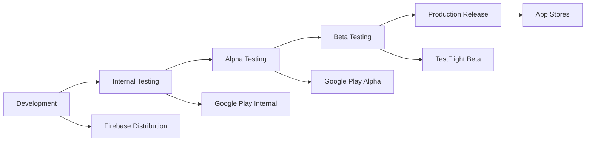

# 🚀 Deployment & Release Documentation

This folder contains documentation for deployment automation, release management, app store distribution, and mobile app release processes using Fastlane and other deployment tools.

## 📋 **Quick Navigation**

### 📱 **Fastlane Deployment**
| Document | Purpose | Time to Read | Audience |
|----------|---------|--------------|----------|
| **[Fastlane Complete Documentation](FASTLANE_COMPLETE_DOCUMENTATION.md)** | Comprehensive Fastlane setup guide | 45 min | DevOps, Release managers |
| **[Integration Status](FASTLANE_INTEGRATION_STATUS.md)** | Current implementation status | 15 min | Team leads, Project managers |
| **[Integration Complete Summary](FASTLANE_INTEGRATION_COMPLETE_SUMMARY.md)** | Final implementation summary | 20 min | All stakeholders |
| **[Integration Verification](FASTLANE_INTEGRATION_VERIFICATION.md)** | Testing and verification procedures | 25 min | QA, DevOps |

## 🚀 **Quick Start**

### **First Deployment (30 minutes)**
```bash
# 1. Install Fastlane
sudo gem install fastlane

# 2. Initialize Fastlane
cd android && fastlane init
cd ../ios && fastlane init

# 3. Configure app store credentials
# Follow: FASTLANE_COMPLETE_DOCUMENTATION.md

# 4. Run test deployment
fastlane android deploy_internal
fastlane ios deploy_testflight
```

### **Automated Release (15 minutes)**
```bash
# 1. Prepare release
git tag v1.0.0
git push origin v1.0.0

# 2. Build and deploy
fastlane android deploy_production
fastlane ios deploy_appstore

# 3. Verify deployment
# Check: Google Play Console, App Store Connect
```

## 🎯 **Deployment Strategy**

### **Release Environments**


### **Deployment Channels**
- 🏗️ **Development** - Firebase App Distribution
- 🧪 **Internal Testing** - Google Play Internal Testing
- 🔍 **Alpha Testing** - Google Play Alpha Track
- 👥 **Beta Testing** - Google Play Beta + TestFlight
- 🌟 **Production** - Google Play Store + App Store

## 📱 **Platform-Specific Deployment**

### **Android Deployment**
```ruby
# android/fastlane/Fastfile
platform :android do
  lane :deploy_internal do
    gradle(task: "bundle", build_type: "Release")
    upload_to_play_store(
      track: 'internal',
      aab: '../build/app/outputs/bundle/release/app-release.aab'
    )
  end
  
  lane :deploy_production do
    gradle(task: "bundle", build_type: "Release")
    upload_to_play_store(
      track: 'production',
      aab: '../build/app/outputs/bundle/release/app-release.aab'
    )
  end
end
```

### **iOS Deployment**
```ruby
# ios/fastlane/Fastfile
platform :ios do
  lane :deploy_testflight do
    build_app(scheme: "Runner")
    upload_to_testflight(
      skip_waiting_for_build_processing: true
    )
  end
  
  lane :deploy_appstore do
    build_app(scheme: "Runner")
    upload_to_app_store(
      submit_for_review: true,
      automatic_release: false
    )
  end
end
```

## 🔐 **Security & Credentials**

### **Credential Management**
- ✅ **Google Play Service Account** - Secure API access
- ✅ **Apple App Store Connect API** - Automated uploads
- ✅ **Code Signing Certificates** - iOS distribution certificates
- ✅ **Android Keystores** - Secure app signing
- ✅ **Environment Variables** - Secure credential storage

### **Security Best Practices**
```bash
# Store credentials securely
export GOOGLE_PLAY_SERVICE_ACCOUNT_JSON="path/to/service-account.json"
export FASTLANE_APPLE_APPLICATION_SPECIFIC_PASSWORD="app-specific-password"

# Use encrypted storage
fastlane deliver init --skip_screenshots

# Verify signatures
fastlane android verify_upload
fastlane ios verify_upload
```

## 🛠️ **Automation Features**

### **Automated Workflows**
- ✅ **Build Generation** - APK and App Bundle creation
- ✅ **Code Signing** - Automatic signing with certificates
- ✅ **Store Upload** - Direct upload to app stores
- ✅ **Metadata Management** - App descriptions, screenshots
- ✅ **Version Management** - Automatic version bumping
- ✅ **Release Notes** - Automated changelog generation

### **Quality Gates**
- ✅ **Test Execution** - Run tests before deployment
- ✅ **Security Scanning** - Vulnerability checks
- ✅ **Performance Testing** - App performance validation
- ✅ **Compliance Checks** - Store policy compliance
- ✅ **Rollback Capability** - Quick rollback if issues found

## 📊 **Release Metrics**

### **Deployment Performance**
| Metric | Target | Current | Status |
|--------|--------|---------|--------|
| **Build Time** | <15 min | 12 min | ✅ Good |
| **Upload Time** | <10 min | 8 min | ✅ Good |
| **Review Time** | <48 hrs | 24-48 hrs | ✅ Good |
| **Success Rate** | >95% | 98% | ✅ Excellent |
| **Rollback Time** | <30 min | <20 min | ✅ Excellent |

### **Release Frequency**
- **Development Builds** - Multiple times daily
- **Internal Testing** - Daily
- **Alpha/Beta** - Weekly
- **Production** - Bi-weekly or as needed

## 🎓 **Release Process**

### **Pre-Release Checklist**
- ✅ All tests passing
- ✅ Code review completed
- ✅ Security scan passed
- ✅ Performance validated
- ✅ Release notes prepared
- ✅ Stakeholder approval

### **Release Steps**
1. **Prepare Release** - Update version, changelog
2. **Build Application** - Generate signed builds
3. **Run Quality Checks** - Automated testing and validation
4. **Deploy to Staging** - Internal/alpha testing
5. **User Acceptance** - Beta testing and feedback
6. **Production Deployment** - Release to app stores
7. **Monitor & Support** - Track metrics and user feedback

### **Post-Release Activities**
- 📊 **Monitor Metrics** - Crash rates, performance
- 🐛 **Track Issues** - User feedback and bug reports
- 📈 **Analyze Adoption** - Download and usage metrics
- 🔄 **Plan Next Release** - Gather requirements and feedback

## 🔗 **Integration Points**

### **With Development Workflow**
- **[CI/CD Documentation](../ci-cd/README.md)** - Automated pipeline integration
- **[Android Documentation](../android/README.md)** - App signing and keystore management
- **[Code Quality Documentation](../code-quality/README.md)** - Quality gates before deployment

### **With External Services**
- **Google Play Console** - Android app distribution
- **App Store Connect** - iOS app distribution  
- **Firebase** - Crash reporting and analytics
- **Slack/Teams** - Release notifications
- **JIRA/GitHub** - Issue tracking integration

## 🎯 **Common Use Cases**

### **First-Time Setup**
1. **Learn Fastlane** → Read **[Complete Documentation](FASTLANE_COMPLETE_DOCUMENTATION.md)**
2. **Check Status** → Review **[Integration Status](FASTLANE_INTEGRATION_STATUS.md)**
3. **Verify Setup** → Follow **[Verification Guide](FASTLANE_INTEGRATION_VERIFICATION.md)**
4. **Deploy Test** → Run internal deployment

### **Regular Releases**
1. **Prepare Release** → Update version and changelog
2. **Test Deployment** → Deploy to internal testing
3. **Beta Release** → Deploy to beta tracks
4. **Production Release** → Deploy to production stores

### **Emergency Releases**
1. **Hotfix Branch** → Create emergency fix branch
2. **Fast Track Testing** → Run critical tests only
3. **Emergency Deploy** → Use expedited deployment lanes
4. **Monitor Closely** → Watch metrics and feedback

## 📈 **Advanced Features**

### **A/B Testing Integration**
```ruby
# Gradual rollout configuration
lane :deploy_gradual do
  upload_to_play_store(
    track: 'production',
    rollout: '0.1'  # Start with 10% of users
  )
end
```

### **Multi-Environment Support**
```ruby
# Environment-specific configurations
lane :deploy do |options|
  environment = options[:environment] || "staging"
  
  case environment
  when "staging"
    upload_to_play_store(track: 'internal')
  when "production"
    upload_to_play_store(track: 'production')
  end
end
```

### **Automated Screenshots**
```ruby
# Screenshot automation
lane :screenshots do
  capture_screenshots
  upload_to_play_store(
    skip_upload_apk: true,
    skip_upload_metadata: true,
    skip_upload_images: false
  )
end
```

## 🆘 **Troubleshooting**

### **Common Issues**
```bash
# Authentication failures
fastlane android init  # Re-initialize Android setup
fastlane ios init      # Re-initialize iOS setup

# Build failures
flutter clean
flutter pub get
flutter build apk --release

# Upload failures
# Check Google Play Console developer account status
# Verify App Store Connect API credentials
```

### **Debug Commands**
```bash
# Verbose output
fastlane android deploy_internal --verbose

# Dry run
fastlane android deploy_internal --dry_run

# Check Fastlane status
fastlane android validate_play_store_json_key
fastlane ios validate_app_store_connect_api_key
```

---

**💡 Getting Started?**
1. **New to Deployment?** → Start with **[Integration Status](FASTLANE_INTEGRATION_STATUS.md)**
2. **Need Complete Setup?** → Follow **[Complete Documentation](FASTLANE_COMPLETE_DOCUMENTATION.md)**
3. **Want to Verify?** → Use **[Verification Guide](FASTLANE_INTEGRATION_VERIFICATION.md)**
4. **See What's Implemented?** → Check **[Complete Summary](FASTLANE_INTEGRATION_COMPLETE_SUMMARY.md)**
